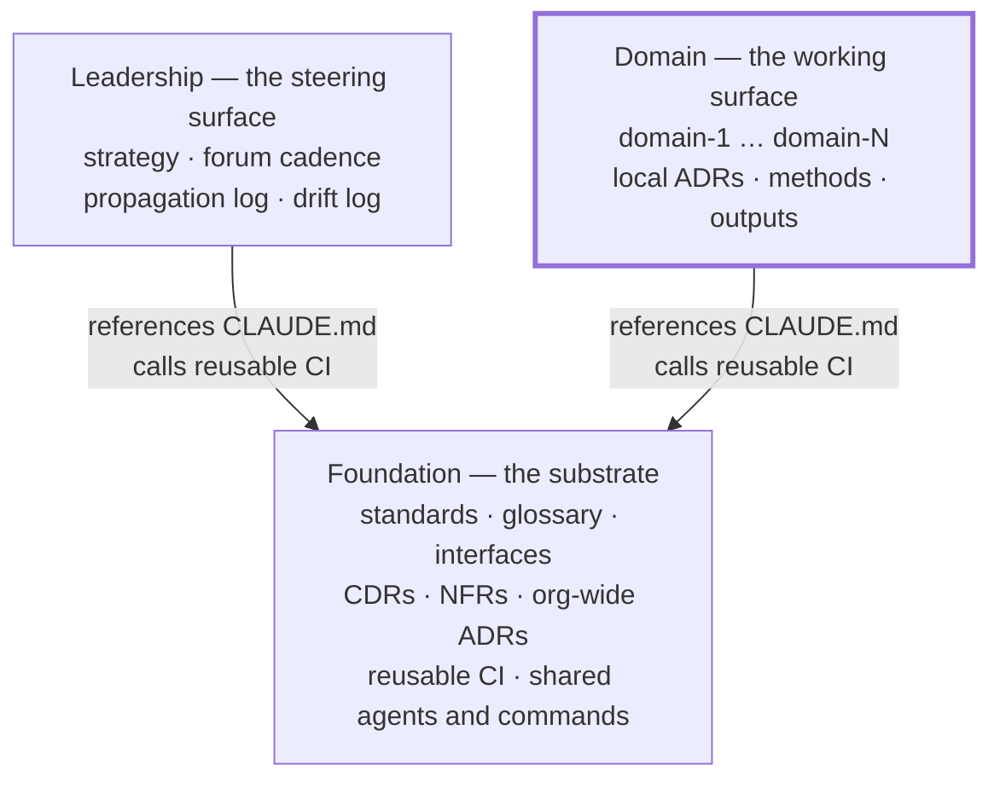
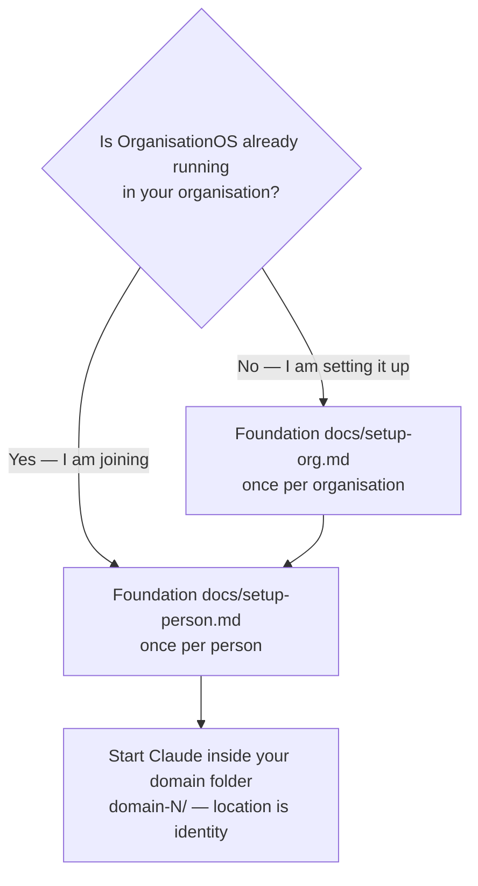

# OrganisationOS — Domain

**The working surface of an OrganisationOS three-repo set.** OrganisationOS is a harness for human↔AI-agent collaboration in a knowledge-work organisation: three Git repositories, a small set of conventions, and CI that keeps them honest. This repo is where the work happens — one folder per domain, each with its own decisions, methods, drafts, outputs and glossary. This repo depends on the Foundation repo for shared standards, templates and CI; it does not redefine them.

## The three repos



| Repo | Holds | |
| --- | --- | --- |
| **Foundation** | Shared standards, decisions, CI and tooling | [organisationos-foundation](https://github.com/<adopter-org>/organisationos-foundation) |
| **Leadership** | Strategy, Forum cadence, propagation log, drift log | [organisationos-leadership](https://github.com/<adopter-org>/organisationos-leadership) |
| **Domain** | Per-domain working content | **You are here** |

On disk the three are siblings under one parent folder. Cross-repo paths are written `../organisationos-foundation/…` from the repo root and `../../organisationos-foundation/` from inside a domain folder, and the settings that give a session reach into Foundation name those exact paths. Nest the repos anywhere else and they break, silently.

```text
~/projects/<adopter-org>/
  organisationos-foundation/     ← clone this first
  organisationos-leadership/
  organisationos-domain/         ← this repo (or one per domain if split)
```

## Where do I start?



- **Setting OrganisationOS up for an organisation** — [setup-org.md](https://github.com/<adopter-org>/organisationos-foundation/blob/main/docs/setup-org.md) in Foundation.
- **Joining as a Team Member, Product Owner or Domain Lead** — [setup-person.md](https://github.com/<adopter-org>/organisationos-foundation/blob/main/docs/setup-person.md) in Foundation. You clone this repo and Foundation; your `CLAUDE.local.md` goes in your domain folder.
- **Understanding it first** — [concepts.md](https://github.com/<adopter-org>/organisationos-foundation/blob/main/docs/concepts.md) and [loading-model.md](https://github.com/<adopter-org>/organisationos-foundation/blob/main/docs/loading-model.md) in Foundation.

## What lives here

| Path | Contents |
| --- | --- |
| `domain-N/` | Per-domain working surface |
| `domain-N/adrs/` | Domain-local Architecture Decision Records |
| `domain-N/glossary.md` | Domain-specific terms (unique to this domain) |
| `domain-N/_drafts/` | Short-lived drafts (14-day shelf life; DRI loop sweeps) |
| `domain-N/methods/` | Domain methods and prompts (Pattern A back-flow) *(user-defined sub-structure)* |
| `domain-N/outputs/` | Committed outputs (Markdown, CSV, etc.) *(user-defined sub-structure)* |
| `domain-N/references.md` | Pointer log to external/live artefacts |

**NOT here:** CDRs, NFRs, cross-domain interfaces, org-wide ADRs, standards, or the shared glossary. Those live in the Foundation repo. If content affects more than one domain, open a PR in Foundation.

## Promotion rule

When an ADR in `domain-N/adrs/` triggers the promotion-lint check (cross-domain mentions or `shared: true` in frontmatter), the author must set one of these fields before merge:

- `promoted-to: <Foundation PR URL>` — companion PR in Foundation exists
- `local-reasoning: <one sentence>` — explicit justification for keeping it domain-local

The CI check `promotion-lint.yml` blocks merge until one field is set.

## Worked example — GreenLeaf Research Lab

GreenLeaf Research Lab runs four domains: **research**, **operations**, **fundraising**, and **compliance**. A Team Member on the research domain drafts an ADR in `domain-research/adrs/` proposing how to anonymise datasets before sharing them externally. The ADR mentions both the operations and compliance domains in the context section.

The `promotion-lint` CI check fires: it detects two domain mentions. The author has two choices: (a) open a companion ADR PR in Foundation (`architectural-decisions/`) and set `promoted-to:` pointing to it, or (b) write `local-reasoning:` explaining why it stays in the research domain (rare; only valid if the other domains are mentioned informally, not substantively).

The author opens a companion ADR PR in Foundation (`architectural-decisions/`). One Leader plus the Domain Lead of research, operations, and compliance review the Foundation ADR. On merge, Admin opens a propagation log entry in Leadership and opens implementation PRs for each affected domain. Each Domain Lead merges their domain's implementation PR independently. The ADR in `domain-research/adrs/` is merged with `promoted-to: <Foundation PR URL>`.

The full circuit is drawn in Foundation's [concepts.md](https://github.com/<adopter-org>/organisationos-foundation/blob/main/docs/concepts.md#how-a-decision-travels).

## Split-per-domain path

When the organisation grows and one Domain repo per domain is preferable, follow these steps to migrate from "one Domain repo with N folders" to "one Domain repo per domain":

1. **Create a new repo** from this template for the domain being extracted (e.g. `organisationos-domain-research`).
2. **Move the folder** — copy `domain-research/` contents into the new repo's root structure.
3. **Update Foundation** — in the Foundation repo, update `glossary.md`'s `## Domains` section to list the new repo, and update `.github/CODEOWNERS` to add the new Domain Lead's handle to the relevant paths.
4. **Update CI callers** — any workflow caller in the old Domain repo that referenced `domain-research/` paths should now reference the new repo. Update `additionalDirectories` in settings files across all affected clones.
5. **Archive the empty folder** — remove the now-empty `domain-research/` folder from this repo in a dedicated PR, with a pointer comment in the commit message to the new repo.
6. **Update CODEOWNERS** — remove the `domain-research/` lines from this repo's `.github/CODEOWNERS`.

This process can be done incrementally — one domain at a time.

## Further reading

- Foundation's [`FORMATS.md`](https://github.com/<adopter-org>/organisationos-foundation/blob/main/FORMATS.md) is mirrored here as `FORMATS.md`; the Foundation copy is canonical and `format-gate` fails a PR if the mirror drifts.
- Each `domain-N/references.md` points at live artefacts that live outside Git.

These templates originate from [2SSilver/organisationos-domain](https://github.com/2SSilver/organisationos-domain), MIT licensed.
